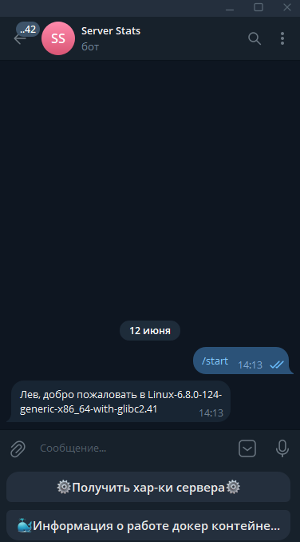
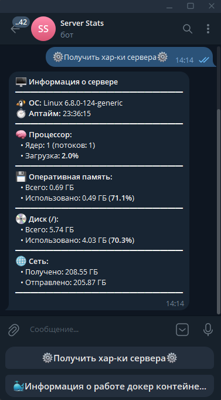

# 🖥️ Telegram bot for server stats

Простой и безопасный Telegram-бот для мониторинга ресурсов сервера и статуса Docker-контейнеров в реальном времени.

## 📸 Скриншоты



## ✨ Возможности

- 🔒 **Безопасность**: Строгая проверка `CHAT_ID`, доступ к командам имеет только владелец.
- 💻 **Мониторинг сервера**: 
  - Название операционной системы и время работы (Uptime).
  - Загрузка процессора (физические ядра, логические потоки, процент использования).
  - Использование оперативной памяти (Всего / Использовано / % в ГБ).
  - Использование дискового пространства корневого раздела (Всего / Использовано / % в ГБ).
  - Общий объем переданных и полученных данных по сети с момента запуска системы (в ГБ).
- 🐳 **Мониторинг Docker**: Мгновенный вывод списка всех контейнеров (включая остановленные), названий образов и текущего статуса с цветовой индикацией (🟢 / 🔴).
- ⌨️ **Удобный интерфейс**: Управление через интуитивно понятную Reply-клавиатуру.
- 🎨 **Красивый вывод**: Форматирование сообщений с использованием HTML-тегов и эмодзи.
- 🐋 **Docker-поддержка**: Запуск бота в контейнере через Docker и docker-compose.


## ⚙️ Требования

- Python 3.8 или выше (для локального запуска)
- Docker и Docker Compose (для контейнерного запуска)
- Токен Telegram-бота (получить у [@BotFather](https://t.me/BotFather))
- Ваш Telegram Chat ID (узнать у [@userinfobot](https://t.me/userinfobot) или [@getidsbot](https://t.me/getidsbot))

## 🚀 Установка и запуск

### Вариант 1: Локальный запуск

1. **Клонируйте репозиторий**:
   ```bash
   git clone https://github.com/Levletsplay0/TG_Bot_Server_stats.git
   cd TG_Bot_Server_stats
   ```

2. **Создайте и активируйте виртуальное окружение**:
   ```bash
   # Для Windows
   python -m venv venv
   venv\Scripts\activate

   # Для Linux / macOS
   python3 -m venv venv
   source venv/bin/activate
   ```

3. **Установите зависимости**:
   ```bash
   pip install -r requirements.txt
   ```

4. **Настройте переменные окружения**:
   Создайте файл `.env` в корневой папке:
   ```env
   BOT_TOKEN=ваш_токен_от_BotFather
   CHAT_ID=ваш_числовой_id_телеграм_аккаунта
   ```

5. **Запустите бота**:
   ```bash
   python main.py
   ```

### Вариант 2: Запуск через Docker (рекомендую)

1. **Клонируйте репозиторий**:
   ```bash
   git clone https://github.com/Levletsplay0/TG_Bot_Server_stats.git
   cd TG_Bot_Server_stats
   ```

2. **Создайте файл `.env`**:
   ```env
   BOT_TOKEN=ваш_токен_от_BotFather
   CHAT_ID=ваш_числовой_id_телеграм_аккаунта
   ```

3. **Запустите через docker-compose**:
   ```bash
   docker compose up -d --build
   ```

4. **Проверьте логи**:
   ```bash
   docker compose logs -f
   ```

5. **Остановка бота**:
   ```bash
   docker compose down
   ```


## 📦 Используемые библиотеки

- `pyTelegramBotAPI` — фреймворк для взаимодействия с Telegram Bot API.
- `psutil` — кроссплатформенная библиотека для получения информации о системных ресурсах.
- `docker` — официальный Python-клиент для Docker Engine.
- `python-dotenv` — загрузка переменных окружения из файла `.env`.

